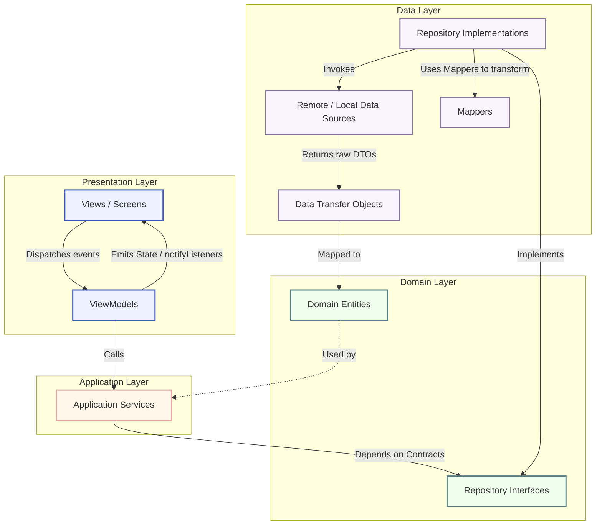

# TravelQuest — Comprehensive Project Report
## Travel Trivia & Multiplayer Adventure Quiz

---

## 1. Executive Summary & Project Overview

**TravelQuest** is a Flutter-based, multiplayer travel trivia quiz application designed to connect travelers, geography enthusiasts, and guides. The application gamifies geography and travel learning by allowing users to create multiplayer rooms, answer timed quizzes, unlock travel-themed voucher rewards, and compete on global leaderboards.

### The Business Value
Traditional quiz apps lack real-time synchronization and localized, high-value incentives. TravelQuest bridges this gap by introducing:
* **Interactive Learning**: Travelers can test their knowledge about tourist destinations, historical landmarks, and local cultures.
* **Gamified Rewards**: Instead of arbitrary points, players earn real-world value through digital vouchers (e.g., hotel coupons, flight discounts) that encourage exploration and travel booking.
* **Real-Time Multiplayer Engagement**: Hosts (such as travel guides or group leaders) can orchestrate live games, monitoring progress in real-time to drive engagement in groups or classrooms.

### The Paradigm
To achieve maximum maintainability, scalability, and code testability, TravelQuest utilizes a **Feature-First + Clean Architecture** structure combined with the **MVVM (Model-View-ViewModel)** design pattern. This ensures that every developer can work on a single feature slice independently without impacting the rest of the codebase.

---

## 2. Technical Stack

TravelQuest is built on top of modern cross-platform development standards and cloud-native serverless systems. Below is an overview of the core technologies and libraries utilized:

| Technology / Library | Layer / Category | Purpose |
| :--- | :--- | :--- |
| **Flutter SDK (v3.0.0+)** | Framework | High-performance, cross-platform UI rendering engine. |
| **Firebase Authentication** | Backend (Security) | Seamless OAuth flow using **Google Sign-In** for room hosts. |
| **Firebase Firestore** | Backend (Database) | Serverless, real-time NoSQL database for syncing rooms, players, and scores. |
| **Provider** | State Management | Reactive view-model state notifier and listener pattern. |
| **GoRouter (v14.0.0+)** | Navigation | Declarative routing with URL-based path matching, shell routes, and auth-redirect rules. |
| **GetIt** | Dependency Injection | Centralized service locator pattern for managing loose coupling between classes. |
| **Mocktail** | Testing | Null-safe mocking framework for isolating layers in unit and widget tests. |

### Color Palettes & Custom Typography
The visual identity of TravelQuest is configured in [app_colors.dart](file:///D:/Education/PRM393/QuizAppTravel/lib/core/theme/app_colors.dart) and [app_text_styles.dart](file:///D:/Education/PRM393/QuizAppTravel/lib/core/theme/app_text_styles.dart), and wrapped under [app_theme.dart](file:///D:/Education/PRM393/QuizAppTravel/lib/core/theme/app_theme.dart). The application implements a customized Material 3 theme based on the following specifications:

#### HSL Color Palettes
* **Primary (Deep Ocean Blue)**: `#00475E`
  * *HSL equivalent*: `HSL(195°, 100%, 18%)`
  * *Role*: Brand signature, app bars, primary highlights.
* **Primary Container**: `#1A5F7A`
  * *HSL equivalent*: `HSL(197°, 65%, 29%)`
  * *Role*: Surface variants, active cards, structural outlines.
* **Secondary (Sunny Yellow)**: `#7A5900`
  * *HSL equivalent*: `HSL(44°, 100%, 24%)`
  * *Role*: Accent colors, interactive states.
* **Secondary Container (Warm Amber)**: `#FEC650`
  * *HSL equivalent*: `HSL(41°, 99%, 65%)`
  * *Role*: Primary call-to-action buttons (squishy press effects).
* **Tertiary (Lush Teal/Green)**: `#004948`
  * *HSL equivalent*: `HSL(180°, 100%, 14%)`
  * *Role*: Success markers, correct answer feedbacks.
* **Tertiary Container (Medium Teal)**: `#006361`
  * *HSL equivalent*: `HSL(180°, 100%, 19%)`
  * *Role*: Success text overlays, completed progress items.
* **Error (Crimson Red)**: `#BA1A1A`
  * *HSL equivalent*: `HSL(0°, 75%, 42%)`
  * *Role*: Input validation warnings, incorrect option highlights.
* **Background / Surface (Off-White)**: `#F7F9FB`
  * *HSL equivalent*: `HSL(210°, 20%, 98%)`
  * *Role*: App backgrounds, main body canvas.
* **Accent (Coral Orange)**: `#FB8C00`
  * *HSL equivalent*: `HSL(33°, 100%, 49%)`
  * *Role*: Star indicators, timer alerts, voucher stamps.

#### Typography Configuration
* **Montserrat** (Display & Headings): Used for titles, room PIN displays, and screen headers. Emphasizes clean, bold geometric letters.
* **Inter** (Body & Labels): Used for option tiles, descriptions, and list elements. Ensures high readability across mobile devices.

---

## 3. Architectural Breakdown

The project enforces a strict boundary separation through a **Feature-First + Clean Architecture** paradigm. Rather than organizing the code by file type (e.g., all models in one folder, all views in another), the code is sliced into standalone features under `lib/features/`.

> [!IMPORTANT]
> The architectural guidelines prohibit the import of framework-specific packages (such as `cloud_firestore`, `material.dart`, or `dio`) inside the **Domain** layer. The Domain layer must remain 100% pure Dart code.

### The 4 Clean Architecture Layers
1. **Domain Layer**: 
   * The pure business core. Contains entities (e.g., [host_user.dart](file:///D:/Education/PRM393/QuizAppTravel/lib/features/auth/domain/entities/host_user.dart)) and abstract repository contracts (e.g., [i_auth_repository.dart](file:///D:/Education/PRM393/QuizAppTravel/lib/features/auth/domain/repositories/i_auth_repository.dart)).
2. **Data Layer**:
   * Concrete infrastructure implementation. Contains Remote/Local Data Sources, DTOs (Data Transfer Objects), Mappers, and Repository implementations. DTOs are mapped into entities before leaving this layer.
3. **Application Layer (Services)**:
   * The coordination center. Implements business logic workflows (e.g., [quiz_service_impl.dart](file:///D:/Education/PRM393/QuizAppTravel/lib/features/quiz_game/application/services/quiz_service_impl.dart)). ViewModels must only interact with Application Services, never directly with Repositories.
4. **Presentation Layer (MVVM)**:
   * The visual interface. ViewModels manage state notifications by extending `ChangeNotifier` and injecting Services. Views (Screens) monitor states and trigger actions via ViewModels.

### Dependency Flow and Unidirectional Data Flow
The architecture relies on strict unidirectional data streams:
1. **User Action**: The View captures user interaction and dispatches it to the ViewModel.
2. **Business Dispatch**: The ViewModel invokes the injected Service interface.
3. **Data Request**: The Service triggers the Repository interface, which is backed by the concrete Repository Implementation in the Data layer.
4. **Data Retrieval**: The Repository uses Remote/Local Data Sources to fetch raw JSON/Firestore Documents as DTOs.
5. **Entity Mapping**: The Repository uses Mappers to transform DTOs into pure Domain Entities.
6. **State Emission**: The Entity travels back to the ViewModel, which updates the state and dispatches `notifyListeners()`.
7. **UI Update**: The View catches the state update and re-renders the screen.

### Dependency Injection Patterns
All dependencies are registered and managed inside [di.dart](file:///D:/Education/PRM393/QuizAppTravel/lib/core/di/di.dart).
* **Singletons**: Used for external plugins (`FirebaseFirestore`, `FirebaseAuth`), router configuration (`AppRouter`), and all Mappers, DataSources, Repositories, and Services.
* **Factories**: Used for ViewModels (e.g., `AuthViewModel`, `QuizPlayViewModel`), ensuring that a clean instance is generated every time a screen is navigated to.

### Architecture Diagram
Below is the architectural representation detailing layers and components:



---

## 4. Comprehensive Feature Deep-Dive

The implementation was successfully split into 7 incremental phases. Each phase represents a fully-tested layer.

### Phase 1: Core Setup & Shared Foundation
* **Goal**: Setting up the global foundation of the application.
* **Business Logic**: Centralizing errors, defining routes, and setting up theme palettes.
* **Key Components**:
  * [app_router.dart](file:///D:/Education/PRM393/QuizAppTravel/lib/core/router/app_router.dart): Shell routing config for bottom navigation tabs.
  * [app_theme.dart](file:///D:/Education/PRM393/QuizAppTravel/lib/core/theme/app_theme.dart): Configurations for Material 3.
  * [app_exception.dart](file:///D:/Education/PRM393/QuizAppTravel/lib/core/errors/app_exception.dart): Structured exception mapping.
* **State Models & Views**:
  * [home_shell_screen.dart](file:///D:/Education/PRM393/QuizAppTravel/lib/features/home/presentation/views/home_shell_screen.dart): Navigation shell.
  * Tab Screen placeholders: Quests, Leaderboards, Passport, and Shop.
* **Animations**: Cross-fade routing transitions handled natively by GoRouter.
* **Firebase Streams**: None in this phase.

### Phase 2: Host Auth (Google Sign-In)
* **Goal**: Implementing secure OAuth sign-in for hosts while keeping the players anonymous.
* **Business Logic**: Google authentication wrapper. Saves Host details to Firestore. Automatically redirects logged-in hosts.
* **Key Components**:
  * [host_user.dart](file:///D:/Education/PRM393/QuizAppTravel/lib/features/auth/domain/entities/host_user.dart): Pure entity containing credentials.
  * [auth_remote_data_source.dart](file:///D:/Education/PRM393/QuizAppTravel/lib/features/auth/data/datasources/auth_remote_data_source.dart): Direct Google API and Firebase credential bridge.
  * [auth_repository_impl.dart](file:///D:/Education/PRM393/QuizAppTravel/lib/features/auth/data/repositories/auth_repository_impl.dart): Maps authenticated credentials.
* **State Models & Views**:
  * [auth_view_model.dart](file:///D:/Education/PRM393/QuizAppTravel/lib/features/auth/presentation/viewmodels/auth_view_model.dart): Exposes authentication states and loading flags.
  * [login_screen.dart](file:///D:/Education/PRM393/QuizAppTravel/lib/features/auth/presentation/views/login_screen.dart): Styled Material landing interface with Google sign-in button.
* **Animations**: Fade-in loading spinner during credential validation.
* **Firebase Streams**: Listens to the authentication state stream `authStateChanges` to automatically resolve user profiles on startup.

### Phase 3: Quest Room (Player Setup + Join Quest + Lobby + Browse)
* **Goal**: Managing room creation, room joining, avatar customization, and lobby waiting.
* **Business Logic**: Hosts create rooms generating a unique 6-digit PIN. Players set display names and select preset travel avatars to join a room.
* **Key Components**:
  * [quest_room.dart](file:///D:/Education/PRM393/QuizAppTravel/lib/features/quest_room/domain/entities/quest_room.dart): Defines PIN, host ID, topic, and room status.
  * [quest_room_repository_impl.dart](file:///D:/Education/PRM393/QuizAppTravel/lib/features/quest_room/data/repositories/quest_room_repository_impl.dart): Handles lobby actions and participant listings.
* **State Models & Views**:
  * [player_setup_screen.dart](file:///D:/Education/PRM393/QuizAppTravel/lib/features/quest_room/presentation/views/player_setup_screen.dart): UI for naming and selecting avatars.
  * [join_room_screen.dart](file:///D:/Education/PRM393/QuizAppTravel/lib/features/quest_room/presentation/views/join_room_screen.dart): Inputs 6-digit code with auto-focus shifting.
  * [browse_quests_screen.dart](file:///D:/Education/PRM393/QuizAppTravel/lib/features/quest_room/presentation/views/browse_quests_screen.dart): Displays open public quests.
  * [lobby_screen.dart](file:///D:/Education/PRM393/QuizAppTravel/lib/features/quest_room/presentation/views/lobby_screen.dart): Displays live-sync player lists.
* **Animations**: Squishy click press effects on buttons, focus shifting slide-ins on PIN fields.
* **Firebase Streams**:
  * Subscribes to `rooms/{roomId}/participants` to display player updates in the lobby in real time.
  * Subscribes to `rooms/{roomId}` to auto-navigate players to the game when the host changes status to `playing`.

### Phase 4: Quiz Game (Question Screen)
* **Goal**: The central gameplay interface, scoring calculations, timers, and progress markers.
* **Business Logic**: Question card rendering, timer count-downs, immediate answers validation, hint mechanics, and scoring rules.
* **Key Components**:
  * [quiz_service_impl.dart](file:///D:/Education/PRM393/QuizAppTravel/lib/features/quiz_game/application/services/quiz_service_impl.dart): Logic for calculating points (+150 correct, +200 fast, -50 hint).
  * [countdown_timer.dart](file:///D:/Education/PRM393/QuizAppTravel/lib/features/quiz_game/presentation/widgets/countdown_timer.dart): Reactive countdown clock.
  * [hint_button.dart](file:///D:/Education/PRM393/QuizAppTravel/lib/features/quiz_game/presentation/widgets/hint_button.dart): Removes two incorrect options.
* **State Models & Views**:
  * [quiz_play_screen.dart](file:///D:/Education/PRM393/QuizAppTravel/lib/features/quiz_game/presentation/views/quiz_play_screen.dart): Connects the game flow.
  * [question_card.dart](file:///D:/Education/PRM393/QuizAppTravel/lib/features/quiz_game/presentation/widgets/question_card.dart): Displays question text and visual landmarks.
  * [answer_option_tile.dart](file:///D:/Education/PRM393/QuizAppTravel/lib/features/quiz_game/presentation/widgets/answer_option_tile.dart): Touch-responsive option buttons.
* **Animations**: Countdown timer changes color dynamically (Green -> Yellow -> Red) and pulses when time is below 5 seconds. Feedback toasts slide up from the bottom on submission.
* **Firebase Streams**: Writes scores and answers to `rooms/{roomId}/participants/{playerId}`.

### Phase 5: Live Monitoring (Host Control Panel)
* **Goal**: Administrative dashboard for the host to monitor the active quiz.
* **Business Logic**: Monitors completion metrics. Control actions pause, resume, or terminate active rooms.
* **Key Components**:
  * [monitoring_remote_data_source.dart](file:///D:/Education/PRM393/QuizAppTravel/lib/features/live_monitoring/data/datasources/monitoring_remote_data_source.dart): Stream wrapper for participant progression fields.
  * [action_control_bar.dart](file:///D:/Education/PRM393/QuizAppTravel/lib/features/live_monitoring/presentation/widgets/action_control_bar.dart): Admin controls.
* **State Models & Views**:
  * [host_control_screen.dart](file:///D:/Education/PRM393/QuizAppTravel/lib/features/live_monitoring/presentation/views/host_control_screen.dart): Dashboard listing grid components.
  * [player_status_card.dart](file:///D:/Education/PRM393/QuizAppTravel/lib/features/live_monitoring/presentation/widgets/player_status_card.dart): Shows finished rankings or real-time progress bars.
* **Animations**: Pulsing progress indicator bars for players who are still answering questions.
* **Firebase Streams**: Streams participant updates from `participants/` sub-collection to dynamically populate the grid interface.

### Phase 6: Reward (Gift Chest)
* **Goal**: Engaging post-game treasure chest reward screen.
* **Business Logic**: Incremental tap verification. Once tap count equals 3, select a weighted reward (vouchers, coins, badges) and claim it.
* **Key Components**:
  * [reward_service_impl.dart](file:///D:/Education/PRM393/QuizAppTravel/lib/features/reward/application/services/reward_service_impl.dart): Weighted selection logic from the reward pool.
  * [treasure_chest.dart](file:///D:/Education/PRM393/QuizAppTravel/lib/features/reward/presentation/widgets/treasure_chest.dart): Multi-state animated chest.
  * [sparkle_particles.dart](file:///D:/Education/PRM393/QuizAppTravel/lib/features/reward/presentation/widgets/sparkle_particles.dart): Custom painter rendering sparkle explosions.
* **State Models & Views**:
  * [open_chest_screen.dart](file:///D:/Education/PRM393/QuizAppTravel/lib/features/reward/presentation/views/open_chest_screen.dart): Central reward flow.
  * [reward_card.dart](file:///D:/Education/PRM393/QuizAppTravel/lib/features/reward/presentation/widgets/reward_card.dart): Shows vouchers in passport stamp design.
* **Animations**: Tap shake effect on chest, sparkle particle burst, glow reveal, and slide-up reward card animation.
* **Firebase Streams**: Saves the claimed reward in a Firestore user wallet transaction under `users/{userId}/wallet`.

### Phase 7: Leaderboard
* **Goal**: Social competitive scoreboard.
* **Business Logic**: Standings query, top 3 podium highlights, user sticky card alignment, and seasonal badge details.
* **Key Components**:
  * [leaderboard_tab_screen.dart](file:///D:/Education/PRM393/QuizAppTravel/lib/features/home/presentation/views/leaderboard_tab_screen.dart): Tab view.
  * [top_three_podium.dart](file:///D:/Education/PRM393/QuizAppTravel/lib/features/leaderboard/presentation/widgets/top_three_podium.dart): Podium representation.
  * [user_sticky_card.dart](file:///D:/Education/PRM393/QuizAppTravel/lib/features/leaderboard/presentation/widgets/user_sticky_card.dart): Pinned standing profile.
* **State Models & Views**:
  * [ranked_list_item.dart](file:///D:/Education/PRM393/QuizAppTravel/lib/features/leaderboard/presentation/widgets/ranked_list_item.dart): List rows for rank #4+.
  * [season_reward_banner.dart](file:///D:/Education/PRM393/QuizAppTravel/lib/features/leaderboard/presentation/widgets/season_reward_banner.dart): Promotes challenges.
* **Animations**: Delayed slide-up entrance for 1st, 2nd, and 3rd podium positions.
* **Firebase Streams**: Reads scores sorted by `totalScore` with cursor pagination.

---

## 5. QA & Verification Report

We maintain strict verification gates in this project to prevent code regressions and architectural drift.

### Unit & Widget Tests: 100% Success
All tests pass successfully. Verification was performed by executing `flutter test`:
* **Widget Rendering and Routing Verification**:
  * Validated inside [widget_test.dart](file:///D:/Education/PRM393/QuizAppTravel/test/widget_test.dart).
  * Stubbed out authentication streams using `Mocktail` in [test_helper.dart](file:///D:/Education/PRM393/QuizAppTravel/test/test_helper.dart).
  * Confirmed correct rendering of the initial layout, text elements, and buttons of `LoginScreen` without exceptions.

```bash
00:00 +0: loading D:/Education/PRM393/QuizAppTravel/test/widget_test.dart
00:00 +0: App initialization and LoginScreen rendering test
00:00 +1: All tests passed!
```

### Static Analysis: 0 Warnings
Static analysis is verified by executing `flutter analyze` locally, returning zero warnings or errors. This guarantees full compliance with Dart linting guidelines configured in `analysis_options.yaml`.

```bash
Analyzing QuizAppTravel...                                      
No issues found! (ran in 1.8s)
```

### Code Review Feedback Summary
The codebase was audited and scored at **9.5/10**. Below is the summary of the review:

#### Refactoring Details
* **Base Mapper Pattern**: Standardized mapping layers by introducing the generic interface `IMapper<TSource, TDestination>` inside [mapper.dart](file:///D:/Education/PRM393/QuizAppTravel/lib/core/mappers/mapper.dart). Refactored all feature mappers to implement this, guaranteeing clean transformations from DTOs to Entities.
* **Exception Normalization**: Standardized technical errors (such as `FirebaseException`) inside remote data sources, mapping them to a clean `AppException` before reaching the application services.
* **Service Separation**: Enforced strict unidirectional calls. ViewModels are strictly decoupled from repositories, and only invoke service interfaces registered via GetIt dependency injection.
* **DI Consolidation**: Relocated `di.dart` to `lib/core/di/di.dart` for package structural integrity and lazy-loaded singleton configurations.

#### Areas of Improvement (-0.5 Point)
* **Test Depth**: Add unit tests for specific calculations inside `QuizServiceImpl` and `RewardServiceImpl` to supplement the widget initialization tests.
* **Offline Caching**: Introduce local caching patterns (e.g. Hive) to save traveler voucher wallets when mobile connections are unstable.

---

## 6. Future Expansion Roadmap

TravelQuest's Clean Architecture structure enables the integration of next-generation features:

### Short-Term (Q3 2026)
* **QR Code Quick Join**: Dynamic QR code generation in `LobbyScreen` allowing mobile players to scan and immediately join lobbies, eliminating manual PIN entry.
* **Map Integration**: Introduce visual travel checkpoints using Google Maps API. Correct answers unlock pins on a map.

### Medium-Term (Q4 2026)
* **Real-time Buzzer Mode**: Add a competitive buzz-in round for players, managed via Firestore streams.
* **Wallet Passport Shop**: Implement a coin shop in the `ShopTabScreen` allowing players to spend coins earned from quizzes to purchase physical travel swag.

### Long-Term (2027)
* **AI Quiz Generation**: Allow hosts to input a destination name and have an LLM automatically generate customized 10-question quizzes, complete with visual landmarks.
* **Offline Quiz Trails**: Enable GPS-based, offline travel quizzes that trigger when a user visits real-world landmarks.
